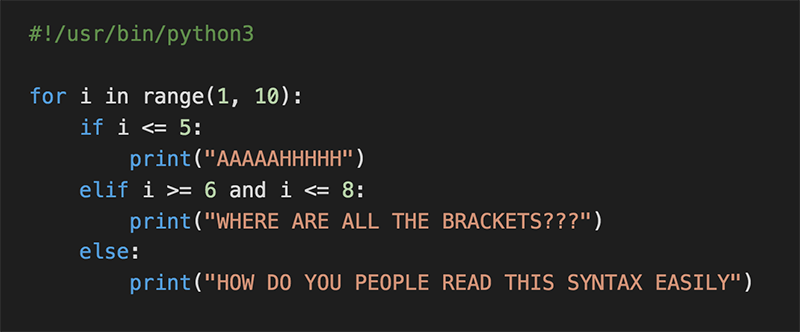

  <h1>Python - if/else, loops, functions</h1>

General

Why indentation is so important in Python  
How to use the if, if ... else statements  
How to use comments  
How to affect values to variables  
How to use the while and for loops  
How to use the break and continues statements  
How to use else clauses on loops  
What does the pass statement do, and when to use it  
How to use range  
What is a function and how do you use functions  
What does return a function that does not use any return statement  
Scope of variables  
What’s a traceback  
What are the arithmetic operators and how to use them

Requirements

Python Scripts

Allowed editors: vi, vim, emacsPython - if/else, loops, functions  
All your files will be interpreted/compiled on Ubuntu 20.04 LTS using python3 (version 3.8._)  
All your files should end with a new line  
The first line of all your files should be exactly #!/usr/bin/python3  
A README.md file, at the root of the folder of the project, is mandatory  
Your code should use the pycodestyle (version 2.7._)  
All your files must be executable  
The length of your files will be tested using wc

[def]: code.png
